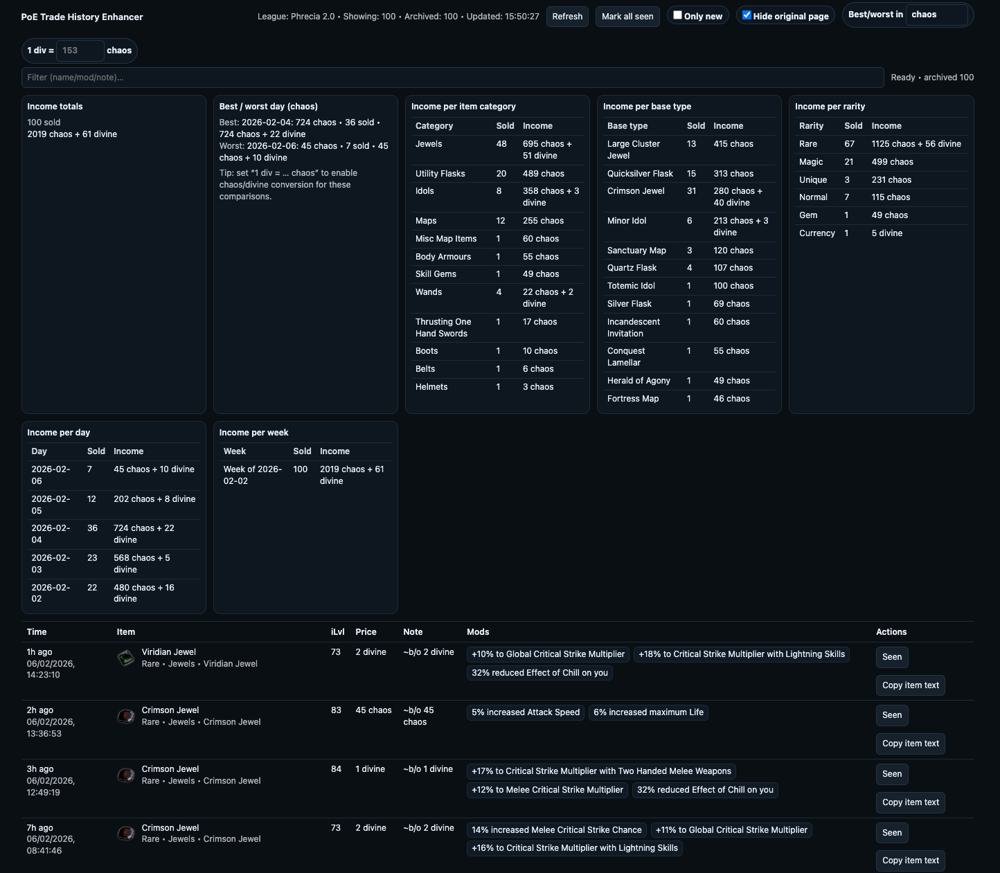

# PoE Trade History Enhancer

Userscript that enhances the official Path of Exile trade history page (`https://www.pathofexile.com/trade/history`) with a modern sticky UI: filtering, "new" highlighting, quick copy of item text, and simple income analytics.

## Screenshot

## Features

- Replaces the default list with a cleaner table (newest-first)
- Filter box (filters across item name/type, price, note, and mods)
- Highlights new entries since you last marked them as seen
- Persists sold history per league in `localStorage` (merges each 100-row API snapshot into a long-term local archive)
- One-click **Copy item text** (copies the in-game item text to your clipboard)
- Basic income stats:
  - Totals per currency
  - Best / worst day (for a selected currency)
  - Income per item category / base type / rarity / day / week
  - Optional chaos↔divine conversion for stats (manual “1 div = … chaos”)
- Optional **Hide original page** toggle (shows only the enhancer UI)

## Install

1. Install a userscript manager:
   - Tampermonkey (Chrome/Edge/Safari)
   - Violentmonkey (Chrome/Firefox)
   - Greasemonkey (Firefox)
2. Install the script:
   - Open [`poe-trade-history-enhancer.user.js`](./poe-trade-history-enhancer.user.js) and use your manager’s “install from file” / “import” feature, **or**
   - From GitHub, open the file and click **Raw** to trigger the install prompt.
3. Visit `https://www.pathofexile.com/trade/history`, select a league, then press **Refresh** if needed.

## Usage

- **Refresh**: fetches the latest history for the currently selected league.
- The UI now shows both visible rows and total **Archived** rows for the selected league.
- If snapshots stop overlapping (likely more than 100 sales happened between refreshes), a **gap detected** warning is shown in status.
- **Only new**: shows only entries you haven’t marked as seen yet.
- **Mark seen / Mark all seen**: updates the seen-state used for “new” highlighting.
- **Best/worst in**: selects which currency to compare days by. If you set **1 div = … chaos**, chaos/divine values are converted for stats (only when a bucket contains chaos/divine only).
- **Filter**: hides rows that don’t match the query.

## Data & privacy

- Stores settings, “seen” item IDs, and per-league archived sold history in `localStorage` in your browser.
- Does not use any external services; it reads the same trade history data the page already loads.

## Development

There’s no build step — it’s a single userscript file.

- Edit: `poe-trade-history-enhancer.user.js`
- Versioning: bump `@version` in the userscript header when you make a release-worthy change.

### Local tests

For local testing, put a captured API response at `local-fixtures/raw-response.json` so you can test core parsing/stats logic without hitting the live PoE API.

- Run: `npm test`

### Browse the fixture locally

If you want to browse the local fixture in a local table/stats UI:

- Run: `npm run browse`
- Open: `http://localhost:3000`

## Disclaimer

This is an **unofficial** fan project and is not affiliated with Grinding Gear Games. The Path of Exile website can change at any time, which may break the script.

## License

GPL-3.0-only. See `LICENSE`.
